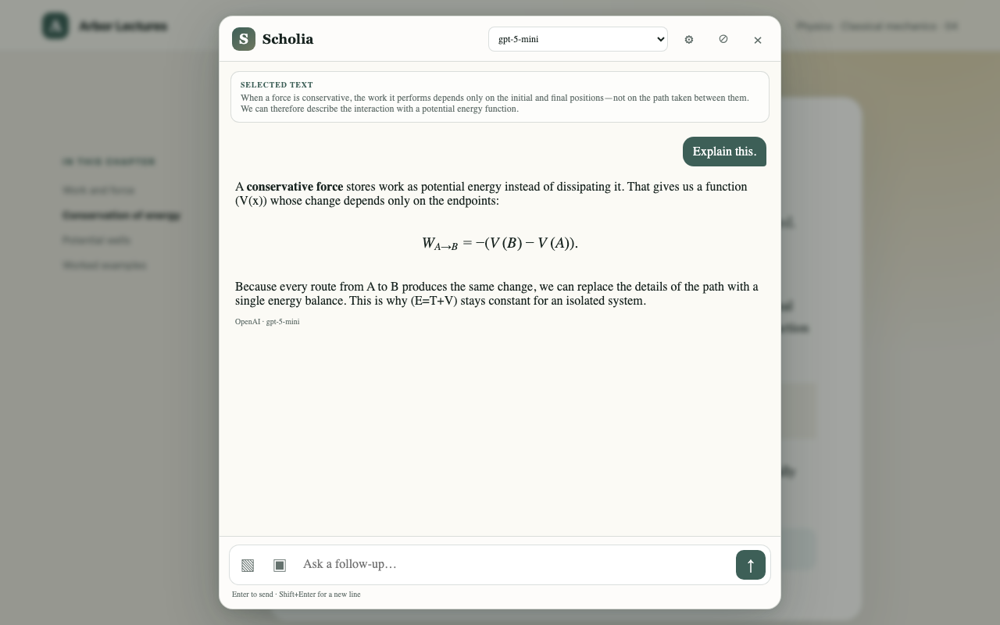

# Scholia

Scholia is a small Chrome extension for asking questions about whatever you are
reading. Select a sentence, an equation, or part of the screen and the answer
opens beside the source.

I built it because copying half a page into a separate chat is a surprisingly
good way to lose the thread of what you were reading.



It can also open a side-panel chat with the current page, read PDFs with page
numbers intact, and search across a site when you explicitly ask it to. Long
documents are ranked locally so the model receives a useful context pack rather
than a blind wall of text.

## Try it

You need Node.js 20 or newer.

```sh
git clone https://github.com/heaps0rt/scholia.git
cd scholia
npm ci
npm run build
```

Open `chrome://extensions`, enable **Developer mode**, choose **Load unpacked**,
and select `dist/chrome`. Then open Scholia's settings and choose a provider.

Useful shortcuts:

- `Ctrl+Shift+E` / `Command+Shift+E` explains the current selection.
- `Ctrl+Shift+S` / `Command+Shift+S` starts a region capture.
- Clicking the toolbar icon opens the page chat.

Rendered math gets a little extra care: click a formula for the whole
expression, or Option/Alt-click to choose a symbol and move wider or narrower
through its structure.

## Providers

Scholia talks directly to the provider you choose. It supports the usual hosted
OpenAI-compatible services, Anthropic, Cohere, Ollama, and a custom endpoint.
There are also optional loopback bridges for tools already installed on your
machine:

| Tool | Endpoint | Start it with |
| --- | --- | --- |
| Claude Code | `127.0.0.1:8787` | `npm run bridge:claude` |
| Codex CLI | `127.0.0.1:8789` | `npm run bridge:codex` |
| opencode | `127.0.0.1:4096` | `opencode serve --port 4096` |
| Ollama | `127.0.0.1:11434` | `ollama serve` |

Hosted traffic must use HTTPS. Plain HTTP is accepted only for a loopback
service on the same device.

## Privacy

There is no Scholia server, analytics, or telemetry. API keys stay in Chrome's
extension storage and requests go straight to the provider you configured.
Page reading, PDF extraction, image resizing, and long-document ranking happen
locally first. Site-wide reading is off until you turn it on for a question.

The details are in the [privacy policy](docs/PRIVACY.md). Use a dedicated,
revocable provider key—Chrome extension storage is convenient, but it is not an
operating-system keychain.

## Development

```sh
npm run check           # syntax checks and tests
npm run build           # unpacked extension in dist/chrome
npm run check:dist      # check the built package
npm run package:chrome  # versioned Web Store ZIP
```

The Chrome extension lives in `apps/chrome`; shared prompts and provider
contracts live in `packages/core`. [Architecture](docs/ARCHITECTURE.md) explains
the boundaries that keep page code, credentials, and model output apart.

There is an early native macOS sketch under `apps/macos`, but the Chrome
extension is the part meant to be used today.

## License

[MIT](LICENSE)
